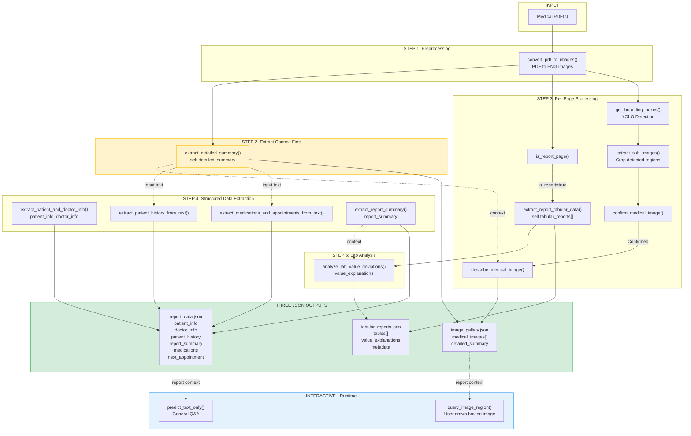

# MARS - Medical Analysis & Report Summarizer

> **AI-powered medical report understanding system** built with Google's MedGemma and a custom fine-tuned YOLO model for the [MedGemma Impact Challenge](https://www.kaggle.com/competitions/med-gemma-impact-challenge).

---

## Features

### Core Capabilities

| Feature | Description |
|---------|-------------|
| **PDF Processing** | Upload multi-page medical PDFs (lab reports, X-rays, prescriptions, discharge summaries) |
| **Medical Image Detection** | Custom fine-tuned YOLO v8 model detects and extracts embedded X-rays, CT scans, MRIs |
| **Structured Data Extraction** | Extracts patient info, doctor info, diagnoses, medications, lab results |
| **Lab Value Analysis** | Identifies abnormal values with patient-friendly explanations |
| **Interactive Image Q&A** | Draw bounding boxes on scans and ask specific questions |
| **Context-Aware Chat** | Ask follow-up questions about the entire report |

### Multi-Agent Architecture

MARS uses **7 specialized MedGemma agents** orchestrated for different tasks:

1. **Page Classifier** - Determines page type (lab report, prescription, imaging, etc.)
2. **Tabular Extractor** - Extracts structured data from tables
3. **Lab Value Analyzer** - Identifies abnormal values and explains significance
4. **Image Describer** - Generates patient-friendly image descriptions
5. **Report Summarizer** - Creates comprehensive summaries
6. **Region Query Agent** - Answers questions about specific image regions
7. **Medical Image Detector** - Custom fine-tuned YOLO for detecting embedded scans

---


## Processing Pipeline



---

## Project Structure

```
MARS/
├── api.py                      # FastAPI backend with REST endpoints
├── medical_report_processor.py # Main orchestrator (multi-agent pipeline)
├── callables.py                # YOLO + MedGemma API wrappers
├── llm_logger.py               # LLM call logging utility
├── requirements.txt            # Python dependencies
├── Dockerfile                  # Container configuration
├── docker-compose.yml          # Docker Compose setup
│
├── fine_tune_yolo/             # YOLO model training
│   └── runs/detect/train4/weights/best.pt  # Fine-tuned weights
│
└── website/                    # React frontend (Vite)
    ├── src/
    │   ├── App.jsx             # Main application component
    │   └── App.css             # Glassmorphism styling
    ├── package.json            # Node dependencies
    └── index.html              # Entry point
```

---

## Getting Started

### Prerequisites

- Python 3.10+
- Node.js 18+ (for frontend)
- Google Cloud account with Vertex AI enabled
- Poppler (for PDF processing)

### 1. Clone the Repository

```bash
git clone https://github.com/Redluigi1/MARS.git
cd MARS
```

### 2. Set Up Python Environment

```bash
# Create virtual environment
python -m venv venv
source venv/bin/activate  # On Windows: venv\Scripts\activate

# Install dependencies
pip install -r requirements.txt
```

### 3. Configure Environment Variables

Create a `.env` file in the root directory:

```env
# Vertex AI Configuration
PROJECT_ID = your-gcp-project-id
REGION = us-central1
ENDPOINT_ID = your-medgemma-endpoint-id

# Google Cloud Credentials
GOOGLE_APPLICATION_CREDENTIALS = key.json
```

> **Important**: You need a `key.json` file with your Google Cloud service account credentials. See [Google Cloud Authentication](https://cloud.google.com/docs/authentication/getting-started).

### 4. Install Poppler (for PDF processing)

**Windows:**
```bash
# Download from: https://github.com/oschwartz10612/poppler-windows/releases
# Add to PATH
```

**macOS:**
```bash
brew install poppler
```

**Linux:**
```bash
sudo apt-get install poppler-utils
```

### 5. Set Up Frontend

```bash
cd website
npm install
```

---

## Running the Application

### Option A: Run Separately (Development)

**Terminal 1 - Backend:**
```bash
# From root directory
python api.py
# or
uvicorn api:app --reload --host 0.0.0.0 --port 8000
```

**Terminal 2 - Frontend:**
```bash
cd website
npm run dev
```

Access the app at: `http://localhost:5173`


---

## API Endpoints

| Endpoint | Method | Description |
|----------|--------|-------------|
| `/` | GET | Health check |
| `/process-pdf` | POST | Process PDF file(s) and extract all data |
| `/predict-text` | POST | Text-only LLM prediction |
| `/predict-multimodal` | POST | Image + text LLM prediction |
| `/get-bounding-boxes` | POST | Run YOLO on image |
| `/query-image-region` | POST | Query specific region of an image |

---

## Output Format

### report_data.json
```json
{
  "patient_info": { "name": "...", "age": "...", "sex": "..." },
  "doctor_info": { "name": "...", "phone": "...", "email": "..." },
  "patient_history": "...",
  "report_summary": {
    "main_findings": "...",
    "patient_explanation": "...",
    "diagnosis": "...",
    "recommendations": "..."
  },
  "medications": [{ "name": "...", "dosage": "...", "frequency": "..." }],
  "next_appointment": "..."
}
```

### image_gallery.json
```json
{
  "medical_images": [
    {
      "image_path": "...",
      "caption": "X-ray of left clavicle",
      "description": "This X-ray shows..."
    }
  ],
  "detailed_summary": "..."
}
```

### tabular_reports.json
```json
{
  "tabular_reports": [
    {
      "page_type": "lab_report",
      "tables": [
        {
          "table_name": "Blood Test Results",
          "columns": ["Test Name", "Value", "Reference Range", "Unit"],
          "rows": [["Hemoglobin", "13.5", "13.0-17.0", "g/dL"]],
          "value_explanations": {
            "0": {
              "test_name": "WBC Count",
              "status": "Low",
              "explanation": "..."
            }
          }
        }
      ]
    }
  ]
}
```

---

## Key Features Explained

### 1. Custom Fine-tuned YOLO for Medical Image Detection
- **Manually created dataset** of 300 annotated medical report images
- Trained to detect X-rays, CT scans, MRIs, ultrasounds embedded in PDFs
- Dataset and training code: [github.com/Redluigi1/medical_image_bounding_box_dataset](https://github.com/Redluigi1/medical_image_bounding_box_dataset)

### 2. Context-Aware Processing
- **detailed_summary** extracted first and used as context for image descriptions
- **report_summary** used as context for lab value analysis
- Ensures coherent, contextually relevant outputs

### 3. Interactive Region Query
- Click and drag on any medical image to select a region
- Ask specific questions like "What is this?" or "Is this normal?"
- Backend annotates the image and sends to MedGemma for focused analysis

### 4. Abnormal Value Tooltips
- Lab values outside reference ranges are highlighted
- Hover to see patient-friendly explanations
- Powered by MedGemma's medical understanding

---

## Tech Stack

| Component | Technology |
|-----------|------------|
| **Backend** | Python, FastAPI, Uvicorn |
| **Frontend** | React, Vite, Three.js (3D background) |
| **AI Model** | MedGemma (via Vertex AI), Custom Fine-tuned YOLO v8 |
| **PDF Processing** | pdf2image, Poppler |
| **Styling** | Custom CSS (Glassmorphism) |
| **Deployment** | Docker, Docker Compose |

---

## License

This project is licensed under the MIT License - see the [LICENSE](LICENSE) file for details.

---

## Acknowledgments

- [Google Health AI Developer Foundations (HAI-DEF)](https://developers.google.com/health-ai-developer-foundations) for MedGemma
- [Ultralytics](https://ultralytics.com/) for YOLO v8
- Built for the [MedGemma Impact Challenge](https://www.kaggle.com/competitions/med-gemma-impact-challenge)
